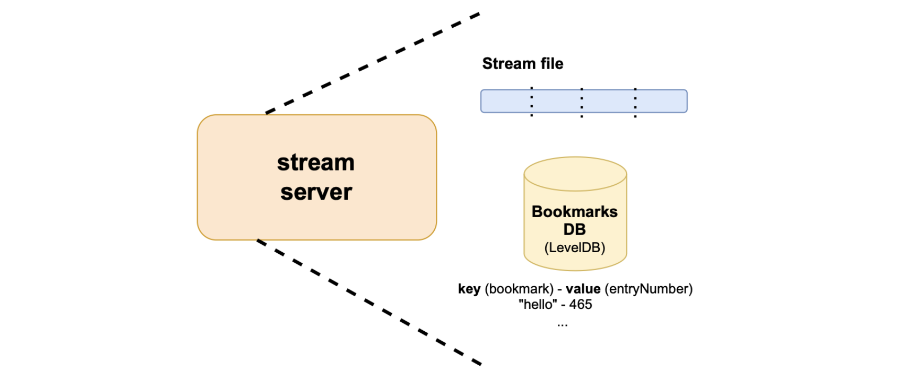

This document describes what bookmarks are, and how they are used in client-server protocol.

A stream is a sequence of entries, where these entries belong to some specific operation, and are identified by an entry number.

In the generic sense, an entry can be any piece of data relevant to an application's context. They can be either events or bookmarks.

Events are defined by the application. Stream clients provide relevant information about an event that must be streamed.

In the case of the Polygon zkEVM, entries are actually L2 blocks, while operations are thought of as batches. 

So then, when the stream source triggers the $\texttt{StartAtomicOp()}$ function and the corresponding message is sent to the stream server, that message in the Polygon zkEVM context, amounts to an instruction to "begin a batch, and prepare to receive its related entries (i.e., blocks) that are about to follow."

Again, in the Polygon zkEVM context, the message sent when the $\texttt{CommitAtomicOp()}$ function is called, is tantamout to saying: "close the batch with the last entry received."

Note that without these two messages, the stream server has no means of knowing where a batch starts and ends.

Similarly, in the client-server protocol, there is a need for a stream client to indicate to the stream server what entry the streaming should begin with.

A **bookmark** is used for this purpose by the stream client. 

### What is a bookmark?

A bookmark is an entry in a stream, and therefore has an entry number, denoted by $\texttt{entryNumber}$.

A bookmark is essentially a string of bytes. It links an $\texttt{entryNumber}$ to a string of bytes in a way that is meaningful to an application.

Stream clients can request stream servers to start the stream from a particular bookmark using the $\texttt{StartBookmark()}$ method.

A bookmark is a type of a stream entry, used as an identifier. It points to a specific position in the stream from which the stream server must begin the streaming.

### StartBookmark command

In addition to the $\texttt{start()}$ and $\texttt{stop()}$ commands of the client-server protocol, a command called $\texttt{StartBookmark()}$ is added.

In the similar way the $\texttt{start()}$ and $\texttt{stop()}$ commands are identified by $\texttt{1}$ and $\texttt{2}$, respectively, the $\texttt{StartBookmark()}$ command is identified with the number $4$.

The $\texttt{StartBookmark()}$command is as follows:  

$$
\begin{aligned}
1.\qquad &\mathtt{u64\ command\ =\ 4} \\
2.\qquad &\mathtt{u64\ streamType} \qquad //\ \texttt{e.g. 1:}\ \mathtt{zkEVM\ Sequencer} \\
3.\qquad &\mathtt{u32\ bookmarkLength} \qquad //\ \texttt{Length of fromBookmark}\\
4.\qquad &\mathtt{u8[\ ]\ fromBookmark}
\end{aligned}
$$

As previously seen with other commands, $\texttt{streamType}$ refers to the network associated with the stream source.

When calling the $\texttt{StartBookmark()}$ function, and the corresponding message is sent to the stream server, the stream client must provide a bookmark. That is, a string of bytes together with the length of the string, denoted by $\texttt{bookmarkLength}$.

**Example**:

Consider the Polygon zkEVM case, where entries are L2 blocks. As seen in the above diagram, a bookmark precedes events.

In this context, the data of each block is preceded by a bookmark entry, and this bookmark entry contains among other things the block number.

It is more meaningful to use the $\texttt{blockNumber}$ in the Polygon zkEVM context.

That is, the $\texttt{blockNumber}$ of the block with which the streaming must begin as requested by the stream client.

### Bookmarks DB

Although stream entries are recorded in the **stream file**, there's a database called **Bookmarks DB**, which is specifically for storing all bookmarks.

The Bookmarks DB is a key-value database that maps a bookmark (used as a key) with its entry number (used as the value). The technology behind Bookmarks DB is [LevelDB](https://github.com/google/leveldb?tab=readme-ov-file), which is an open-source, fast key-value storage library written by Google's developers.

So, when a stream client requests the stream server to start streaming from a specific bookmark, it provides the bookmark as a string of bytes.

The stream server performs a binary search in order to locate the bookmark in the Bookmarks DB, and fetches the corresponding $\texttt{entryNumber}$ from the Bookmarks DB. It then begins to stream entries, starting from the $\texttt{entryNumber}$ onwards.

All commands made by stream clients return a response, called a $\texttt{Result}$ entry. The format of such a $\texttt{Result}$ entry is as follows:

$$
\begin{aligned}
1.\qquad &\texttt{u8 packetType  // 0xff:Result} \\
2.\qquad &\texttt{u32 length // Total length of the entry} \\
3.\qquad &\texttt{u32 errorNum // Error code (e.g. 0:OK)} \\
4.\qquad &\texttt{u8[] errorStr}
\end{aligned}
$$

Whenever a stream client calls the $\texttt{start()}$ function, the stream server responds with the $\texttt{Result}$ entry first, followed by all the entries.

In the client-server protocol, each message from the stream server has its identifier or packetType.

As seen in the code above, the $\texttt{Result}$ entry has the identifier, $\texttt{0xff}$, at the protocol level.

The $\texttt{Result}$ identifier is followed by the total length of the entry.

Next is a code of an error message, $\texttt{errorStr}$. If everything goes well then a $\texttt{0}$ is sent, meaning $\texttt{OK}$. 

A string is also sent, which is in a more human readable text.

An error is sent in the form of a code and a string, where the string is just an array of bytes, and each byte is an ASCII character.
