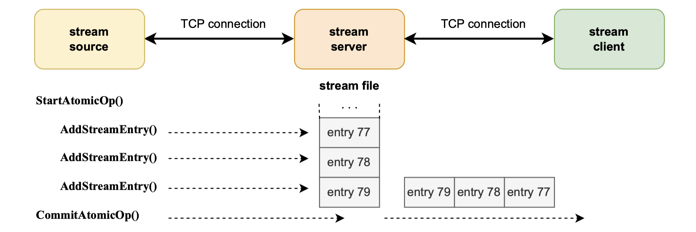
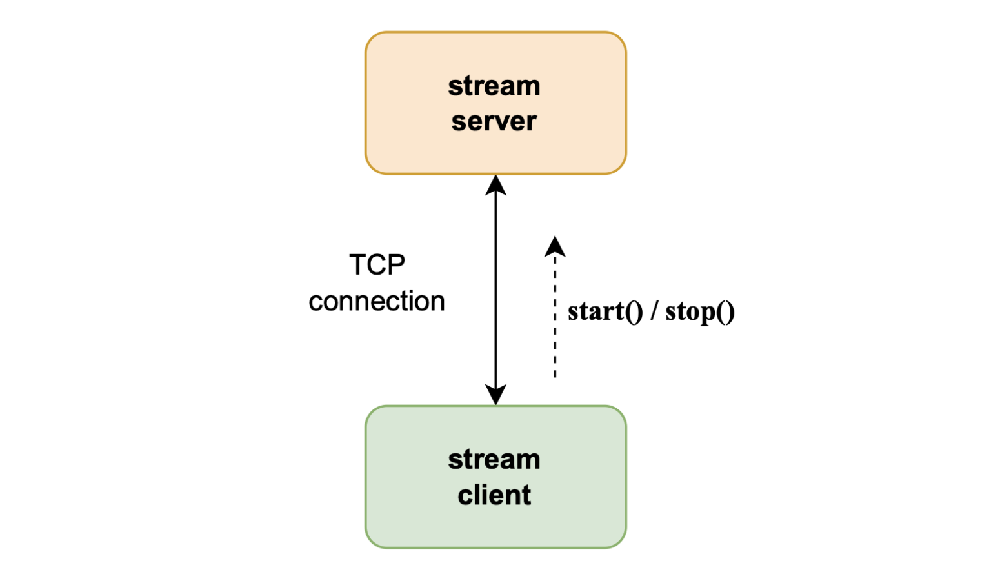

This document explains the two data streamer protocols; server-source protocol, and client-server protocol.

### Server-source protocol

The stream source and stream servers connect via TCP, which is the most reliable way to send and receive data over the internet.

The server-source protocol, built on top of the TCP connection, involves transmission of generic messages between the stream source and a stream server.

In a generic sense, the messages being sent from the stream source to the stream server are entries related to a particular atomic operation.

An operation is atomic if either all the entries of the operation are included in the flow and streamed, or none of them are streamed.

The protocol starts with the stream source calling the $\texttt{StartAtomicOp()}$ function, which sends the corresponding message to the stream server, indicating that the stream source is ready to send entries associated with a particular atomic operation $\texttt{Op}$.

The number of the sent entries depends on a particular atomic operation $\texttt{Op}$. 

Entries received in the stream server are sequentially numbered across all atomic operations, and are stored in a file called **stream file**. 

For instance, if there are two atomic operations $\mathtt{Op_A}$ and $\mathtt{Op_B}$, where $\mathtt{Op_A}$ has four (4) entries and $\mathtt{Op_B}$ has three (3) entries, then the entries are sequenced as follows:

$$
\texttt{entry}\ \mathtt{6}\ ||\ \texttt{entry}\ \mathtt{5}\ ||\ \texttt{entry}\ \mathtt{4}\ ||\ \texttt{entry}\ \mathtt{3}\ ||\ \texttt{entry}\ \mathtt{2}\ ||\ \texttt{entry}\ \mathtt{1}\ ||\ \texttt{entry}\ \mathtt{0}
$$

When all the entries have been sent, the stream source calls a function called $\texttt{CommitAtomicOp()}$ which automatically sends a commit message to the stream server. 

Upon receipt of the commit message, the stream server can begin sending the entries to stream clients.

Entries are streamed sequentially by the stream-server on a "first-received-first-sent" basis.

There's a possibility to rollback the atomic operation using the $\texttt{RollbackAtomicOp()}$ function, and thus stopping all entries related to atomic operations from being streamed to stream clients. 

However, a rollback of an atomic operation can only be executed if the operation has not been committed. That is, an operation can only be rolled if its corresponding $\texttt{CommitAtomicOp()}$ function has not been called, and hence a commit message has not been sent to the stream server.

The Polygon zkEVM team provides a library written in Go which allows the stream source to interact with stream servers.

### Client-server protocol

The stream client and stream server also connect via TCP.

In this protocol a stream client sends messages to a connected stream server, that are requests to send entries related to atomic operations.

The basic protocol involves the stream client calling two main functions; $\texttt{start()}$ or $\texttt{stop()}$, and thus sending a corresponding message to the stream server in order to either start or stop sending a stream of entries.

#### The start() message

The stream client calls the $\texttt{start()}$ function which sends a message to the server, requesting data to be streamed. It can also request for the stream to begin at a specified entry number.

The stream client's $\texttt{start()}$ function specifies three 64-bit unsigned integers, as follows:

$$
\begin{aligned}
1.\qquad &\mathtt{u64\ command} = 1 \\
2.\qquad &\mathtt{u64\ streamType} \qquad // \ \ \mathtt{e.g.,\ 1 :\ zkEVM sequencer} \\
3.\qquad &\mathtt{u64\ fromEntryNumber}
\end{aligned}
$$

The value assigned to $\texttt{command}$ indicates whether a  $\texttt{start()}$ or $\texttt{stop()}$ function has called by the client. As shown in the first line of the above code, $\mathtt{command\ =\ 1}$ means the stream client called the $\texttt{start()}$ function.

In the second line, $\texttt{streamType}$ refers to the stream source node to which the stream server should connect. For example, $\mathtt{streamType\ =\ 1}$ means the source node is the zkEVM sequencer node.

The third line specifies which entry the stream should start at. If $\mathtt{streamType\ =\ 1}$ and $\mathtt{fromEntryNumber\ =\ 74}$, then the stream starts at $\mathtt{blockNum\ =\ 74}$.

Note that calling a $\texttt{start()}$ function in the middle of an active stream (i.e., while receiving entries) results in termination of the stream, and the TCP connection is also lost.

Basically, receiving a "start-a-stream" message from the same stream client to which streaming is in progress, is interpreted by the stream server as an error.

#### The stop() message

The stream client can send another message to the stream server, by calling the $\texttt{stop()}$ function. Such a message is a request to stop streaming data.

The stream client's $\texttt{stop()}$ function takes two 64-bit parameters, as shown below:

$$
\begin{aligned}
1.\qquad &\mathtt{u64\ command\ = 2\ } \\ 
2.\qquad &\mathtt{ u64\ streamType} \qquad //\  \mathtt{e.g.,\ 1 :\ zkEVM sequencer}
\end{aligned}
$$

Setting the value of $\mathtt{command}$ to $\mathtt{2}$, as shown in the first line of the above code, means the stream server should stop the stream.

As in the case of the $\texttt{start()}$ function, the variable $\texttt{streamType}$ in the $\texttt{stop()}$ function codes, indicates the stream source to which the stream server must connect.

The $\texttt{stop()}$ function does not specify any $\texttt{fromEntryNumber}$.

Note that calling the $\texttt{stop()}$ function while streaming is in progress causes the stream to be terminated, but without losing the TCP connection.

However, if the stream client triggers the $\texttt{stop()}$ function when there is no streaming in progress, the TCP connection terminates.
